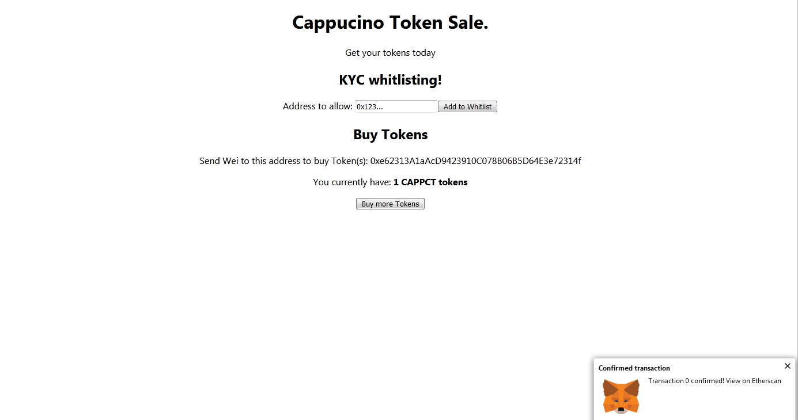

# Tokenization
Procedure to use App  
After deploying contracts on github and connecting ethereum client to your network(can be testnet) You can see following interface.  
  
Now you can use this dApp  
1.whitlist your account with the account address you want.after whitlisting you can see alert for whitlisting completed  
2.Now you can buy tokens using whitlisted address by pressing "Buy more Tokens" button(or by sending Wei ammount to the address shown).  (after buying tokens you can see transaction confirmation from your client -> after confirming -> you can see updated token ammount).  
Screenshot bellow shows updated token ammount.

